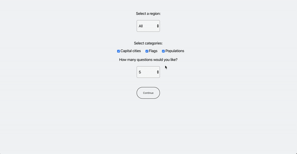

# Geo Quiz

React.js web app utilising a REST API for country data to allow users to test their geography knowledge. Users can choose a specific region, number of questions and categories such as flags, capitals and populations to generate questions and answers, with their score being presented on completion.

Technologies used:
- React
- React Hooks
- SCSS
- Jest

See the code in the browser [here!](https://jovial-shockley-ee3800.netlify.app/)

## Available Scripts

In the project directory, you can run:

### `npm start`

Runs the app in the development mode. 
Open [http://localhost:3000](http://localhost:3000) to view it in the browser.

The page will reload if you make edits. 
You will also see any lint errors in the console.

### `npm test`

Launches the test runner in the interactive watch mode. 
See the section about [running tests](https://facebook.github.io/create-react-app/docs/running-tests) for more information.
